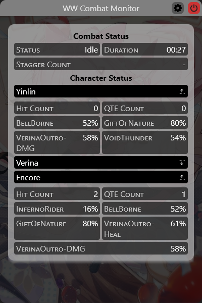

# Wuthering Waves Combat Monitor

## Screenshot

## How it works?

_Credits: [MorphTheMoth/WuwaDpsMeter](https://github.com/MorphTheMoth/WuwaDpsMeter) gave me an idea of tracking the log file._

Log file of WW contains a wealth of informations, including life values of the entity parts, allowing us to calculate DPS by tracking them.

## Caveats

- Unfortunately the damage on parts is not affected by real damage. damage calculation is removed.
- Not all buffs are tracked.

## Credits

- [MorphTheMoth/WuwaDpsMeter](https://github.com/MorphTheMoth/WuwaDpsMeter) gave me an idea of tracking the log file.
- Button icons in the app are from [SVG Repo](https://www.svgrepo.com/).
- Background image and executable icon file are from [Official Weibo](https://weibo.com/u/7730797357).
